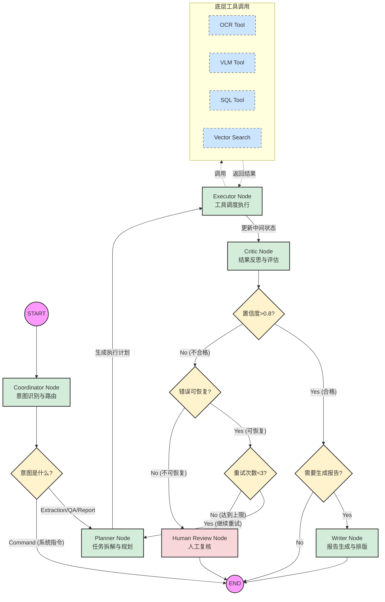

# 🏗️ 施工记录智能识别系统 - 开发者规格说明书 (Developer Specification)

## 1. 项目概述

本作为**施工记录智能识别系统**的开发者文档，旨在指导开发团队构建一个基于 **LangGraph + AI Components** 的智能体系统。该系统旨在将非结构化的施工文档（图片、PDF、扫描件）转化为结构化数据，并提供智能查询与分析能力。

本项目已从早期的“固定流水线”架构升级为**自主智能体（Agentic）架构**。系统不再机械地执行 OCR -> NER -> ETL 流程，而是引入了**感知-推理-行动-反思**的决策回路，能够根据文档的复杂度和质量，动态规划处理路径，自我修正错误，并随着使用积累长期记忆。

## 2. 核心特点

1.  **动态决策回路 (Dynamic Decision Loop)**:
    *   通过 `Planner Agent` 动态生成执行计划，而非硬编码流程。
    *   引入 `Critic Agent` 进行结果反思与质量把控，不合格结果会自动触发重试或人工复核。

2.  **多模态融合 (Multi-modal Fusion)**:
    *   结合 OCR (PaddleOCR)、VLM (Qwen-VL) 和 NLP (Qwen-72B) 能力。
    *   支持对文本、表格、手写体、印章等复杂元素的混合识别。

3.  **记忆与持续进化 (Memory & Evolution)**:
    *   **短期记忆**: 维护当前任务的上下文与中间变量。
    *   **长期记忆**: 基于向量数据库 (Milvus/Qdrant) 存储历史成功案例 (Few-shot)，使系统越用越聪明。

4.  **企业级护栏 (Enterprise Guardrails)**:
    *   内置 **策略引擎 (Policy Engine)**，在模型调用前进行预算控制、敏感数据脱敏和合规性检查。
    *   **统一状态管理 (State Store)**，确保分布式环境下的状态一致性与可追溯性。

## 3. 技术选型与理由

### 3.1 核心框架

| 环节 | 选型 | 理由 |
| :--- | :--- | :--- |
| **语言** | Python 3.10+ | AI 生态首选，强类型的支持 (Pydantic) 对构建复杂系统至关重要。 |
| **编排** | **LangGraph** | 相比 LangChain Chain，LangGraph 的图结构原生支持循环（Loop）、分支和状态持久化，完美契合 Agent 的反复推理需求。 |
| **Web** | FastAPI | 高性能异步框架，原生支持 WebSocket (流式输出) 和 OpenAPI 文档生成。 |

### 3.2 AI 模型组件

| 环节 | 选型 | 理由 |
| :--- | :--- | :--- |
| **OCR** | **PaddleOCR v4** | 针对中文场景优化最佳的开源 OCR，支持方向检测和表格结构还原。 |
| **VLM** | **Qwen-VL-Chat** | 通义千问视觉大模型，在中文文档理解（DocVQA）和表格解析上表现优异，且支持本地部署。 |
| **LLM** | **Qwen-72B / GPT-4** | 推理能力强，适合承担 Planner 和 Critic 的逻辑判断角色。 |
| **Embedding** | **BGE-M3** | 多语言、长文本支持极佳的 Embedding 模型，用于向量检索。 |

### 3.3 数据与基础设施

| 环节 | 选型 | 理由 |
| :--- | :--- | :--- |
| **Vector DB** | **Milvus / Qdrant** | 专为向量检索设计，支持海量数据低延迟查询，用于长期记忆库。 |
| **State Store** | **Redis** | 高性能 KV 存储，用于维护 Agent 的瞬时状态 (State Snapshot) 和消息队列。 |
| **Graph DB** | **Neo4j** (可选) | 用于存储项目-人员-文档的实体关系网，辅助推理。 |
| **Container** | Docker + K8s | 标准化交付，便于 GPU 资源的调度与扩缩容。 |

## 4. 系统架构与模块设计

系统采用 **“大脑-身体-工具”** 分层架构：

### 4.1 核心模块 (`src/`)

```text
src/
├── agents/             # [大脑] 智能体逻辑
│   ├── coordinator.py  # 总控：任务分发与预算控制
│   ├── planner.py      # 规划：生成 DAG 执行计划 (ReAct/Plan-and-Solve)
│   ├── executor.py     # 执行：调度工具，处理异常
│   ├── critic.py       # 反思：结果校验，质量打分
│   └── writer.py       # 写作：报表与文档生成
├── core/               # [神经系统] 基础设施
│   ├── state.py        # 统一状态定义 (TaskState)
│   ├── memory.py       # 记忆管理 (Short/Long-term)
│   └── policy.py       # 策略引擎 (Budget, Guardrails)
├── tools/              # [手] 原子能力封装
│   ├── vision/         # OCRTool, VLMTool
│   ├── data/           # SQLTool, VectorSearchTool
│   └── file/           # PDFParser, ExcelWriter
└── schemas/            # 数据协议 (Pydantic Models)
```

### 4.2 关键交互流程与 LangGraph 编排设计

在多智能体架构中，关于“智能体是否作为 LangGraph 的 Node”，系统支持两种视角的理解与实现。本项目核心采用 **“智能体即节点 (Agent-as-a-Node)”** 的 LangGraph 原生编排模式，但也兼容底层的 **“事件驱动 (Event-Driven)”** 异步交互。

#### 模式一：基于 LangGraph 的图节点交互（核心架构）
在这种模式下，每个 Agent（如 Planner, Executor, Critic）都被封装为 LangGraph 中的一个 `Node`。全局共享一个 `TaskState`（状态字典），通过图的 `Edge`（边）和 `Conditional Edge`（条件路由）实现状态流转。

**LangGraph 流程图**:



**详细交互流程**：
1. **入口路由 (Coordinator Node)**: 
   - 用户请求进入图的起点 `Coordinator`。
   - `Coordinator` 更新 `TaskState`，进行权限和预算校验，并根据意图决定下一步的路由。如果意图是系统指令则直接结束，如果是业务任务则路由到 `Planner Node`。
2. **规划阶段 (Planner Node)**:
   - 接收 `TaskState`，从 Memory Store 检索相似经验（Few-shot）。
   - 生成具体的执行步骤（如 `[OCR -> NER -> VLM]`），写入 `TaskState["plan"]`。
3. **执行阶段 (Executor Node)**:
   - 读取 `TaskState["plan"]`，依次调度底层 Tool（如调用 PaddleOCR）。
   - 将工具的原始输出写入 `TaskState["intermediate_results"]`。
4. **反思与评估 (Critic Node)**:
   - 检查 `intermediate_results` 的完整性和逻辑一致性。
   - **条件路由 (Conditional Edge)**:
     - 如果置信度高（>0.8）：检查任务类型，如果是报表任务则路由到 `Writer Node`，否则直接结束（`END`）。
     - 如果置信度低（<0.8）：首先进行**快速失败 (Fast Fail)** 判断。如果检测到不可恢复的致命错误（如源文件损坏、图片全黑），直接跳出循环，路由到 `Human_Review_Node`。
     - 如果错误可恢复且重试次数未达上限：生成反馈意见写入 `TaskState["feedback"]`，路由回 `Planner Node` 重新规划（形成 ReAct 循环）。
     - 如果多次重试失败：路由到 `Human_Review_Node`（人工复核）。
5. **报告生成 (Writer Node)**:
   - 仅在任务类型为“报表生成 (Report)”且数据校验合格时触发。
   - 接收结构化数据，调用模板引擎或绘图工具，生成最终的文档（PDF/Markdown），随后结束（`END`）。

#### 模式二：非图节点交互模式（事件驱动/微服务解耦）
如果未来系统扩展，某些重型 Agent（如需要长时间 GPU 排队的 VLM Agent）不适合作为同步的图节点阻塞 LangGraph 的执行，系统将采用**基于消息队列（Redis/Celery）的异步交互流程**。此时，Agent 不再是 LangGraph 的 Node，而是独立的服务。

**详细交互流程**：
1. **任务分发**: `Coordinator` 接收请求后，生成一个全局 `Task_ID`，并将任务事件推送到消息队列（如 `extraction_queue`），随后立即向用户返回 `Task_ID`（非阻塞）。
2. **独立订阅**: `Planner Agent` 作为独立微服务订阅队列，获取任务后生成计划，并将计划事件推送到 `execution_queue`。
3. **异步执行**: `Executor Agent` 消费执行事件，调用耗时的 GPU 模型（如 Qwen-VL）。执行完毕后，将结果写入 Redis/PostgreSQL，并发布 `evaluation_queue` 事件。
4. **回调与反思**: `Critic Agent` 消费评估事件，如果发现错误，它不通过图的边返回，而是重新发布一个带有 `feedback` 的事件到 `planning_queue`。
5. **状态聚合**: 前端通过 WebSocket 或轮询 API，根据 `Task_ID` 从 Redis 中实时获取各个独立 Agent 更新的进度状态。

**总结**：本项目当前在 `construction-ai-langgraph` 模块中采用**模式一（Agent即Node）**，以利用 LangGraph 强大的状态管理和可视化调试能力；而在 `backend` 的长耗时任务处理中，结合了**模式二**的思想，通过 Celery 进行外层异步包装。

### 4.3 智能体角色详解

#### 4.3.1 Coordinator Agent (总控智能体)
**职责**: 类似于交响乐团的指挥或公司的项目经理。它不直接干活（不跑 OCR，不写 SQL），而是负责**接待、分诊、风控和兜底**。

**核心功能**:
1.  **意图识别与路由**: 基于用户指令和输入类型，决定任务的流转方向：
    *   **业务任务 (Extraction/QA/Report)**: 处理上传的图片/PDF（目标是结构化入库）、处理自然语言提问（目标是检索并生成答案）、处理复杂聚合请求（如生成报表）。Coordinator 会将这些任务统一路由给 `Planner Agent` 进行详细规划。
    *   **系统指令 (Command)**: 处理运维与配置类指令（如“将阈值调整为0.8”或“清除OCR缓存”）。Coordinator 会进行严格的**权限校验**，直接调用 `SystemTool` 或 `AdminAPI` 执行操作，并记录审计日志，随后直接结束流程。
2.  **资源与权限门禁**: 检查用户是否有权操作该项目，项目余额是否由足，预估任务复杂度。
3.  **异常熔断与降级**: 当子 Agent（如 Planner）陷入死循环或耗时过长时，强制介入终止，并返回友好的降级回复。
4.  **人机交互管理**: 决定何时打断流程请求人工确认（Human-in-the-loop）。

**交互示例**:

> **场景**: 用户上传了一份模糊的《2026年2月施工现场隐患排查表.jpg》，并备注“急需提取隐患项”。

1.  **接收请求**: Coordinator 收到图片和 Prompt。
2.  **前置检查 (Pre-check)**:
    *   *Policy Check*: 用户是“项目经理”，权限通过。
    *   *Budget Check*: 图片预估 Token 消耗 0.05 USD，项目余额充足。
3.  **意图路由 (Routing)**:
    *   识别为 `Extraction Task`（提取任务）。
    *   而不是 `QA Task`（检索任务）或 `Report Task`（报表）。
    *   初始化 `TaskState`，标记 `priority=High`（因为用户说了“急需”）。
4.  **委托 (Delegate)**: 将状态传递给 `Planner Agent`，指令：“处理这个图片，专注提取隐患项”。
5.  **监控 (Monitor)**:
    *   如果 `Planner` 反馈图片太模糊无法处理，`Coordinator` 不会直接崩溃，而是请求用户：“图片清晰度不足，请重新上传或手动输入关键信息”。

#### 4.3.2 Planner Agent (规划智能体)
**职责**: 负责将复杂任务拆解为可执行的步骤（DAG 或线性计划），并根据上下文动态调整策略。它是系统的“大脑”和“战术制定者”。

**核心功能**:
1.  **任务拆解 (Task Decomposition)**: 将 Coordinator 分配的宏观任务（如“提取这份模糊表格中的隐患项”）拆解为具体的工具调用序列（如 `[ImageEnhancement -> TableOCR -> LLM_Extraction]`）。
2.  **经验检索 (Experience Recall)**: 在制定计划前，从长期记忆库（Memory Store）中检索类似文档的处理经验（Few-shot examples），以提高计划的成功率。
3.  **动态调整 (Dynamic Replanning)**: 当 Executor 执行失败或 Critic 认为结果不达标时，Planner 会接收反馈并重新生成备用计划（例如，OCR 失败则尝试调用 VLM）。

#### 4.3.3 Executor Agent (执行智能体)
**职责**: 负责具体执行 Planner 制定的计划步骤，调度底层工具，并处理执行过程中的异常。它是系统的“手”和“实干家”。

**核心功能**:
1.  **工具调度 (Tool Invocation)**: 根据计划步骤，准确调用对应的工具（如 `OCRTool`, `SQLTool`, `VectorSearchTool`），并传递正确的参数。
2.  **异常处理与重试 (Error Handling & Retry)**: 捕获工具执行过程中的异常（如网络超时、API 报错），进行有限次数的重试或降级处理。
3.  **状态更新 (State Update)**: 将每一步的执行结果（成功、失败、中间数据）更新到全局状态（TaskState）中，供其他 Agent 读取。

#### 4.3.4 Critic Agent (反思/评估智能体)
**职责**: 负责对 Executor 的输出结果进行质量把控和逻辑校验。它是系统的“质检员”和“纠错者”。

**核心功能**:
1.  **结果校验 (Result Validation)**: 检查提取的数据是否符合预期的 Schema（如日期格式、必填项），校验逻辑一致性（如“整改期限”不能早于“检查日期”）。
2.  **置信度评估 (Confidence Scoring)**: 结合 OCR 的置信度和 LLM 的自我评估，对最终结果打分。
3.  **快速失败判断 (Fast Fail)**: 评估“错误的可恢复性”。如果检测到不可恢复的致命错误（如源文件损坏、图片全黑、文件格式不支持等），直接跳出重试循环，将状态标记为失败，并交由使用人决定后续操作，避免浪费计算资源。
4.  **反馈生成 (Feedback Generation)**: 如果结果不达标且错误可恢复，生成具体的修改建议（如“第2行隐患描述提取不完整，请重新识别该区域”），并将其反馈给 Planner 触发重试；如果多次失败，则标记为需要“人工复核”。

#### 4.3.5 Writer Agent (文书智能体)
**职责**: 专注于“输出表达”。将结构化数据、图片和分析结论转化为人类可读的高质量文档（如周报 HTML、PDF 或 Markdown 摘要）。

**核心功能**:
1.  **数据可视化**: 调用绘图工具（Matplotlib/Echarts）将统计数据转化为图表。
2.  **排版渲染**: 根据模板（Jinja2）生成标准格式的报告。
3.  **摘要生成**: 对长篇幅的施工日志进行润色和总结。

## 5. 测试方案

### 5.1 单元测试 (Unit Test)
*   **工具层**: 针对 `OCRTool`、`SQLTool` 编写 Mock 测试，验证输入输出格式的一致性。
*   **逻辑层**: 测试 `PolicyEngine` 的拦截逻辑（如超过预算是否报错）。

### 5.2 集成测试 (Integration Test)
*   **模拟回路**: 构造虚拟的 Tool Output，测试 `Planner -> Executor -> Critic` 的状态流转是否闭环。
*   **并发测试**: 使用 `Locust` 模拟 50+ 并发请求，验证 Redis 状态锁和消息队列的稳定性。

### 5.3 评估测试 (Evals)
*   建立 **Golden Dataset**（包含 100 份标注好的典型施工文档）。
*   主要指标：
    *   **字段准确率**: 提取字段与真值的匹配度。
    *   **Planner 成功率**: 生成的计划是否逻辑通顺且可执行。
    *   **幻觉率**: Critic 是否能识别出模型编造的数据。

## 6. 项目排期与跟踪

### 阶段一：基础设施与工具化 (Week 1-2)
*目标：完成基础组件封装，实现工具的标准化调用。*

| 任务编号 | 任务名称 | 状态 | 完成日期 | 备注 |
| :--- | :--- | :--- | :--- | :--- |
| T1-01 | **环境搭建** | To Do | 2026-02-25 | 初始化 Poetry, Docker, Pre-commit |
| T1-02 | **状态定义 (State Schema)** | To Do | 2026-02-26 | 定义 `TaskState` 和 `PlanStep` |
| T1-03 | **工具封装: OCR/VLM** | To Do | 2026-02-28 | 封装 PaddleOCR/Qwen-VL 为 LangChain Tool |
| T1-04 | **工具封装: Storage** | To Do | 2026-03-01 | 封装 MinIO 和 PostgreSQL 交互 |

### 阶段二：智能体核心逻辑 (Week 3-4)
*目标：实现 Planner/Executor/Critic 三大核心智能体。*

| 任务编号 | 任务名称 | 状态 | 完成日期 | 备注 |
| :--- | :--- | :--- | :--- | :--- |
| T2-01 | **Planner Agent 开发** | To Do | 2026-03-05 | 实现基于 LLM 的计划生成 |
| T2-02 | **Executor Agent 开发** | To Do | 2026-03-08 | 实现工具调度与错误重试 |
| T2-03 | **Critic Agent 开发** | To Do | 2026-03-12 | 实现基于规则+LLM 的评分逻辑 |
| T2-04 | **LangGraph 流程编排** | To Do | 2026-03-15 | 串联 Agent，跑通“即使”循环 |

### 阶段三：记忆与策略 (Week 5)
*目标：引入长期记忆与策略控制，提升系统稳健性。*

| 任务编号 | 任务名称 | 状态 | 完成日期 | 备注 |
| :--- | :--- | :--- | :--- | :--- |
| T3-01 | **Policy Engine 实现** | To Do | 2026-03-18 | 预算控制、敏感词过滤 |
| T3-02 | **Memory Store 集成** | To Do | 2026-03-21 | 接入 Milvus，实现 RAG 检索 |
| T3-03 | **Prompt 调优** | To Do | 2026-03-23 | 优化 Few-shot 效果 |

### 阶段四：联调与交付 (Week 6)
*目标：端到端测试，性能优化与文档交付。*

| 任务编号 | 任务名称 | 状态 | 完成日期 | 备注 |
| :--- | :--- | :--- | :--- | :--- |
| T4-01 | **Evals 数据集构建** | To Do | 2026-03-25 | 准备 Golden Data |
| T4-02 | **性能压测** | To Do | 2026-03-28 | 优化并发吞吐量 |
| T4-03 | **UI 对接** | To Do | 2026-03-31 | 前端展示 Trace 和中间状态 |

### 阶段五：可观测性集成 (Week 7)
*目标：集成 Langfuse、Jaeger、Prometheus 等追踪工具，完成整体监控方案。*

| 任务编号 | 任务名称 | 状态 | 完成日期 | 备注 |
| :--- | :--- | :--- | :--- | :--- |
| T5-01 | **Langfuse 集成** | To Do | 2026-04-01 | LLM 调用追踪 |
| T5-02 | **OpenTelemetry 集成** | To Do | 2026-04-03 | 分布式链路追踪 |
| T5-03 | **Prometheus 指标收集** | To Do | 2026-04-05 | 系统级别监控 |
| T5-04 | **Grafana Dashboard** | To Do | 2026-04-08 | 可视化仪表板 |

## 7. 可扩展性与未来展望

### 7.1 可扩展性设计
*   **工具热插拔**: 新增工具（如"工程图纸CAD解析"）不仅需要编写代码，只需在 `ToolRegistry` 并更新 `tools_description`，Planner 即可感知并使用。
*   **多模型路由**: 支持通过配置切换底层 LLM（如从 Qwen-72B 切换到 GPT-4o），以适应不同成本/精度需求的任务。

### 7.2 未来规划
*   **多智能体协作 (MARL)**: 引入"专家会诊"模式，让结构工程师Agent、预算员Agent共同审核一份复杂文档。
*   **端侧轻量化**: 将 OCR 和轻量级 VLM 蒸馏后部署在边缘设备（如施工现场的手持终端），实现离线初步识别。
*   **主动学习 (Active Learning)**: 将人工修正后的数据自动加入训练集，定期微调 LoRA 模型，实现"越用越懂业务"。

## 8. 可观测性与追踪 (Observability & Tracing)

详见 [OBSERVABILITY.md](./OBSERVABILITY.md) 文档，包含：
- **追踪工具选型**：Langfuse、Langsmith、OpenTelemetry 等
- **追踪指标体系**：LLM 调用、工具调用、Agent 执行、端到端请求的完整追踪
- **集成实现方案**：代码示例和配置指南
- **可视化与分析**：Langfuse Dashboard、Jaeger UI、Grafana 仪表板
- **应用场景**：成本优化、性能优化、质量监控、故障诊断
