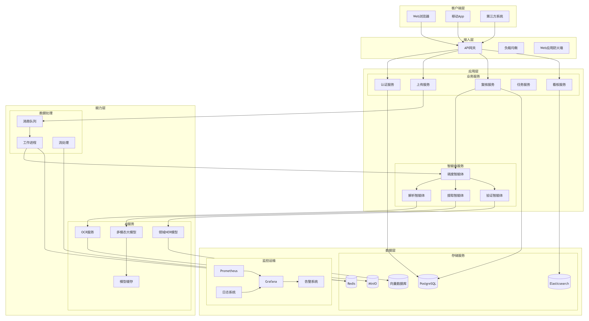

# 🏗️ 施工记录智能识别系统 - 系统架构设计

## 1. 架构总览

### 1.1 架构目标

* **高可用性** ：99.5%系统可用性
* **可扩展性** ：支持水平扩展，应对业务增长
* **可维护性** ：模块化设计，易于升级维护
* **安全性** ：多层次安全防护，数据隐私保护
* **性能** ：单张处理≤30秒，支持并发处理

### 1.2 架构原则

1. **微服务化** ：业务功能解耦，独立部署
2. **事件驱动** ：异步处理，提高吞吐量
3. **数据驱动** ：基于数据反馈持续优化
4. **DevOps** ：CI/CD自动化，快速迭代

## 2.总体架构图



## 3. 详细架构设计

### 3.1 客户端层

#### 3.1.1 Web前端

```javascript
// 技术栈
前端框架: React 18 + TypeScript
UI库: Ant Design 5.0
状态管理: Zustand
路由: React Router 6
构建工具: Vite
包管理: pnpm

// 模块划分
src/
├── pages/           // 页面组件
│   ├── Upload/     // 上传页面
│   ├── Review/     // 复核页面
│   ├── Dashboard/  // 数据看板
│   ├── Query/      // 智能查询页面
│   └── Admin/      // 管理后台
├── components/      // 通用组件
│   ├── Layout/     // 布局组件
│   ├── ReviewPanel/ // 复核面板
│   ├── FileList/   // 文件列表
│   └── ChatBox/    // 聊天框
├── services/       // API服务
│   ├── auth.ts     // 认证服务
│   ├── upload.ts   // 上传服务
│   ├── review.ts   // 复核服务
│   └── query.ts    // 查询服务
├── stores/         // 状态管理
│   ├── user.ts     // 用户状态
│   ├── task.ts     // 任务状态
│   └── config.ts   // 配置状态
└── utils/          // 工具函数
```

#### 3.1.2 移动端

```javascript
// 技术栈
框架: React Native / Flutter
UI库: Ant Design Mobile / Flutter SDK
状态管理: Provider / GetX
打包: iOS/Android双平台

// 核心功能
1. 拍照上传
2. 离线缓存
3. 消息推送
4. 扫码识别
5. 语音查询
```

### 3.2 接入层

#### 3.2.1 API网关 (Kong)

```yaml
# Kong配置示例
services:
  - name: upload-service
    url: http://upload-service:8001
    routes:
      - name: upload-route
        paths: ["/api/v1/upload"]
        methods: ["POST"]
      
  - name: review-service
    url: http://review-service:8002
    routes:
      - name: review-route
        paths: ["/api/v1/review"]
        methods: ["GET", "POST", "PUT"]
  
  - name: query-service
    url: http://query-service:8003
    routes:
      - name: query-route
        paths: ["/api/v1/query"]
        methods: ["POST"]

plugins:
  - name: rate-limiting
    config:
      minute: 100  # 每分钟100次
      policy: local
    
  - name: jwt
    config:
      secret: ${JWT_SECRET}
      claims_to_verify: ["exp", "iss"]
```

#### 3.2.2 负载均衡 (Nginx)

```nginx
# Nginx配置
upstream backend {
    server backend1:8000 weight=3;
    server backend2:8000 weight=3;
    server backend3:8000 weight=4;
  
    # 健康检查
    check interval=3000 rise=2 fall=3 timeout=1000;
}

server {
    listen 443 ssl;
    server_name construction-ai.com;
  
    ssl_certificate /etc/ssl/cert.pem;
    ssl_certificate_key /etc/ssl/key.pem;
  
    location /api/ {
        proxy_pass http://backend;
        proxy_set_header Host $host;
        proxy_set_header X-Real-IP $remote_addr;
      
        # 文件上传大小限制
        client_max_body_size 100M;
      
        # 超时设置
        proxy_connect_timeout 60s;
        proxy_send_timeout 60s;
        proxy_read_timeout 60s;
    }
}
```

### 3.3 应用层

#### 3.3.1 微服务架构

```yaml
# 服务清单
services:
  auth-service:      # 认证服务
    port: 8001
    dependencies: [postgres, redis]
    health: /health
  
  upload-service:    # 上传服务
    port: 8002
    dependencies: [minio, rabbitmq]
    health: /health
  
  review-service:    # 复核服务
    port: 8003
    dependencies: [postgres, redis, rabbitmq]
    health: /health
  
  query-service:      # 查询服务
    port: 8004
    dependencies: [postgres, redis, rabbitmq, vector_db]
    health: /health
  
  dashboard-service: # 看板服务
    port: 8005
    dependencies: [postgres, elasticsearch]
    health: /health
  
  ai-orchestrator:   # AI调度服务
    port: 8006
    dependencies: [redis, rabbitmq, ai-services]
    health: /health
```

#### 3.3.2 智能体架构 (LangGraph)

```python
# 智能体编排
class ConstructionAgentSystem:
    """施工记录智能体系统"""
  
    def __init__(self):
        # 智能体注册表
        self.agents = {
            'orchestrator': OrchestratorAgent(),
            'information_extraction': InformationExtractionAgent(),
            'qa_query': QAQueryAgent()
        }
      
        # 工作流引擎
        self.workflow = LangGraphWorkflow()
      
    async def process_document(self, document):
        """处理文档工作流 - 场景一"""
        # 1. 智能调度
        task = await self.agents['orchestrator'].route_document(document)
      
        # 2. 信息抽取
        if task.type == 'extraction':
            extracted = await self.agents['information_extraction'].process(document)
            return extracted
      
    async def process_query(self, query):
        """处理查询工作流 - 场景二"""
        # 1. 智能调度
        task = await self.agents['orchestrator'].route_query(query)
      
        # 2. 问答查询
        if task.type == 'query':
            result = await self.agents['qa_query'].process(query)
            return result

# 信息抽取智能体
class InformationExtractionAgent:
    """信息抽取智能体"""
  
    async def process(self, document):
        """执行信息抽取流程"""
        # Step 1: OCR识别
        ocr_result = await self._ocr_node(document)
      
        # Step 2: 领域NER
        ner_result = await self._ner_node(ocr_result)
      
        # Step 3: VLM精炼
        vlm_result = await self._vlm_node(document, ner_result)
      
        # Step 4: 数据存储
        await self._storage_node(vlm_result)
      
        # Step 5: 人工复核
        await self._review_node(vlm_result)
      
        return vlm_result

# 问答与查询智能体
class QAQueryAgent:
    """问答与查询智能体"""
  
    async def process(self, query):
        """执行问答查询流程"""
        # Step 1: 意图识别与工具规划
        intent = await self._intent_recognition_node(query)
      
        # Step 2: SQL查询
        if intent.needs_sql:
            sql_result = await self._sql_query_node(intent)
        else:
            sql_result = None
      
        # Step 3: 向量检索
        if intent.needs_vector_search:
            vector_result = await self._vector_search_node(query)
        else:
            vector_result = None
      
        # Step 4: 答案合成
        answer = await self._answer_synthesis_node(query, sql_result, vector_result)
      
        return answer
```

### 3.4 能力层

#### 3.4.1 AI服务架构

```python
# AI服务容器化部署
# docker-compose-ai.yml
version: '3.8'

services:
  # OCR服务
  ocr-service:
    image: paddleocr:latest
    deploy:
      resources:
        reservations:
          devices:
            - driver: nvidia
              count: 1
              capabilities: [gpu]
    environment:
      - GPU_ID=0
      - BATCH_SIZE=16
    ports:
      - "8007:8000"
    
  # VLM服务
  vlm-service:
    image: qwen-vl:latest
    deploy:
      resources:
        reservations:
          devices:
            - driver: nvidia
              count: 2
              capabilities: [gpu]
    environment:
      - MODEL_PATH=/models/qwen-vl
      - DEVICE=cuda:0,1
    ports:
      - "8008:8000"
    
  # NER服务
  ner-service:
    image: construction-ner:latest
    build:
      context: ./models/ner
      dockerfile: Dockerfile
    ports:
      - "8009:8000"
    
  # LLM服务
  llm-service:
    image: qwen-72b:latest
    deploy:
      resources:
        reservations:
          devices:
            - driver: nvidia
              count: 4
              capabilities: [gpu]
    environment:
      - MODEL_PATH=/models/qwen-72b
      - DEVICE=cuda:0,1,2,3
    ports:
      - "8010:8000"
    
  # 模型网关
  model-gateway:
    image: nginx:alpine
    ports:
      - "8011:80"
    volumes:
      - ./configs/model-gateway.conf:/etc/nginx/nginx.conf
```

#### 3.4.2 消息队列设计

```python
# RabbitMQ队列设计
QUEUES = {
    # 上传队列
    'upload_queue': {
        'name': 'document.upload',
        'durable': True,
        'arguments': {'x-max-priority': 10}
    },
  
    # OCR队列
    'ocr_queue': {
        'name': 'ai.ocr',
        'durable': True,
        'arguments': {'x-max-priority': 5}
    },
  
    # VLM队列
    'vlm_queue': {
        'name': 'ai.vlm',
        'durable': True,
        'arguments': {'x-max-priority': 8}
    },
  
    # 查询队列
    'query_queue': {
        'name': 'ai.query',
        'durable': True,
        'arguments': {'x-max-priority': 7}
    },
  
    # 复核队列
    'review_queue': {
        'name': 'task.review',
        'durable': True,
        'arguments': {'x-max-priority': 3}
    },
  
    # 死信队列
    'dlq': {
        'name': 'dead.letter',
        'durable': True
    }
}

# 消息格式
class ProcessingMessage(BaseModel):
    message_id: str
    document_id: str
    task_type: str  # 'upload', 'ocr', 'vlm', 'query', 'review'
    priority: int = 5
    payload: Dict
    created_at: datetime
    retry_count: int = 0
```

### 3.5 数据层

#### 3.5.1 数据库设计

```sql
-- 核心表结构
-- 1. 用户表
CREATE TABLE users (
    id SERIAL PRIMARY KEY,
    username VARCHAR(50) UNIQUE NOT NULL,
    email VARCHAR(100) UNIQUE,
    phone VARCHAR(20),
    role VARCHAR(20) NOT NULL,  -- admin, manager, engineer
    project_ids JSONB,          -- 负责的项目ID列表
    settings JSONB,             -- 用户设置
    created_at TIMESTAMP DEFAULT NOW(),
    updated_at TIMESTAMP DEFAULT NOW()
);

-- 2. 项目表
CREATE TABLE projects (
    id SERIAL PRIMARY KEY,
    name VARCHAR(100) NOT NULL,
    code VARCHAR(50) UNIQUE NOT NULL,
    description TEXT,
    manager_id INTEGER REFERENCES users(id),
    status VARCHAR(20) DEFAULT 'active',
    metadata JSONB,
    created_at TIMESTAMP DEFAULT NOW()
);

-- 3. 文档表
CREATE TABLE documents (
    id SERIAL PRIMARY KEY,
    file_hash VARCHAR(64) UNIQUE NOT NULL,
    original_name VARCHAR(255),
    file_path VARCHAR(500),
    file_type VARCHAR(20),
    file_size BIGINT,
    uploader_id INTEGER REFERENCES users(id),
    project_id INTEGER REFERENCES projects(id),
    status VARCHAR(20) DEFAULT 'uploaded',  -- uploaded, processing, completed, error
    created_at TIMESTAMP DEFAULT NOW(),
    INDEX idx_status (status),
    INDEX idx_project (project_id)
);

-- 4. 处理任务表
CREATE TABLE processing_tasks (
    id SERIAL PRIMARY KEY,
    document_id INTEGER REFERENCES documents(id),
    task_type VARCHAR(20) NOT NULL,  -- ocr, vlm, ner, validation
    status VARCHAR(20) DEFAULT 'pending',  -- pending, processing, completed, failed
    input_data JSONB,
    output_data JSONB,
    error_message TEXT,
    processing_time FLOAT,
    started_at TIMESTAMP,
    completed_at TIMESTAMP,
    created_at TIMESTAMP DEFAULT NOW(),
    INDEX idx_document (document_id),
    INDEX idx_status_type (status, task_type)
);

-- 5. 提取结果表
CREATE TABLE extraction_results (
    id SERIAL PRIMARY KEY,
    document_id INTEGER REFERENCES documents(id),
    version INTEGER DEFAULT 1,
    extracted_data JSONB NOT NULL,
    confidence_scores JSONB,
    reviewed_by INTEGER REFERENCES users(id),
    review_status VARCHAR(20) DEFAULT 'pending',  -- pending, approved, rejected
    review_notes TEXT,
    reviewed_at TIMESTAMP,
    created_at TIMESTAMP DEFAULT NOW(),
    updated_at TIMESTAMP DEFAULT NOW(),
    INDEX idx_document_version (document_id, version),
    INDEX idx_review_status (review_status)
);

-- 6. 施工记录表（结构化数据）
CREATE TABLE construction_records (
    id SERIAL PRIMARY KEY,
    project_id INTEGER REFERENCES projects(id),
    project_name VARCHAR(100),
    construction_location VARCHAR(200),
    date DATE,
    weather VARCHAR(50),
    work_content TEXT,
    quantity VARCHAR(50),
    unit VARCHAR(20),
    workers TEXT,
    machinery TEXT,
    quality_status VARCHAR(50),
    issues TEXT,
    safety_records TEXT,
    inspector VARCHAR(50),
    supervisor VARCHAR(50),
    document_id INTEGER REFERENCES documents(id),
    created_at TIMESTAMP DEFAULT NOW(),
    INDEX idx_project_date (project_id, date),
    INDEX idx_location (construction_location)
);

-- 7. 查询历史表
CREATE TABLE query_history (
    id SERIAL PRIMARY KEY,
    user_id INTEGER REFERENCES users(id),
    query_text TEXT NOT NULL,
    query_type VARCHAR(20),  -- sql, vector, hybrid
    query_result JSONB,
    response_time FLOAT,
    created_at TIMESTAMP DEFAULT NOW(),
    INDEX idx_user (user_id),
    INDEX idx_created (created_at)
);

-- 8. 模型版本表
CREATE TABLE model_versions (
    id SERIAL PRIMARY KEY,
    model_type VARCHAR(20) NOT NULL,  -- ocr, vlm, ner, llm
    version VARCHAR(50) NOT NULL,
    model_path VARCHAR(500),
    performance_metrics JSONB,
    is_active BOOLEAN DEFAULT FALSE,
    deployed_at TIMESTAMP,
    created_at TIMESTAMP DEFAULT NOW()
);
```

#### 3.5.2 缓存设计

```python
# Redis缓存策略
class CacheManager:
    """缓存管理"""
  
    def __init__(self):
        self.redis = redis.Redis(
            host=config.REDIS_HOST,
            port=config.REDIS_PORT,
            db=0,
            decode_responses=True
        )
  
    # 缓存键设计
    CACHE_KEYS = {
        # 用户相关
        'user:{user_id}': {'ttl': 3600, 'desc': '用户信息'},
      
        # 文档相关
        'document:{doc_id}': {'ttl': 1800, 'desc': '文档信息'},
        'document_status:{doc_id}': {'ttl': 300, 'desc': '文档状态'},
      
        # AI结果缓存
        'ocr_result:{file_hash}': {'ttl': 86400, 'desc': 'OCR结果'},
        'vlm_result:{file_hash}': {'ttl': 86400, 'desc': 'VLM结果'},
        'query_result:{query_hash}': {'ttl': 3600, 'desc': '查询结果'},
      
        # 配置缓存
        'project_config:{project_id}': {'ttl': 3600, 'desc': '项目配置'},
        'model_config:{model_type}': {'ttl': 1800, 'desc': '模型配置'},
      
        # 会话缓存
        'session:{session_id}': {'ttl': 7200, 'desc': '用户会话'},
      
        # 限流缓存
        'rate_limit:{user_id}:{action}': {'ttl': 60, 'desc': '限流计数'}
    }
  
    async def get_with_cache(self, key, func, *args, **kwargs):
        """带缓存的获取"""
        # 先查缓存
        cached = await self.redis.get(key)
        if cached:
            return json.loads(cached)
      
        # 缓存未命中，执行函数
        result = await func(*args, **kwargs)
      
        # 设置缓存
        ttl = self.CACHE_KEYS.get(key.split(':')[0] + ':*', {}).get('ttl', 300)
        await self.redis.setex(key, ttl, json.dumps(result))
      
        return result
```

### 3.6 部署架构

#### 3.6.1 Kubernetes部署

```yaml
# deployment.yaml
apiVersion: apps/v1
kind: Deployment
metadata:
  name: construction-ai-api
spec:
  replicas: 3
  selector:
    matchLabels:
      app: construction-ai-api
  template:
    metadata:
      labels:
        app: construction-ai-api
    spec:
      containers:
      - name: api
        image: construction-ai-api:latest
        ports:
        - containerPort: 8000
        env:
        - name: DATABASE_URL
          valueFrom:
            secretKeyRef:
              name: db-secret
              key: url
        resources:
          requests:
            memory: "512Mi"
            cpu: "250m"
          limits:
            memory: "1Gi"
            cpu: "500m"
        livenessProbe:
          httpGet:
            path: /health
            port: 8000
          initialDelaySeconds: 30
          periodSeconds: 10
        readinessProbe:
          httpGet:
            path: /ready
            port: 8000
          initialDelaySeconds: 5
          periodSeconds: 5
---
# service.yaml
apiVersion: v1
kind: Service
metadata:
  name: construction-ai-service
spec:
  selector:
    app: construction-ai-api
  ports:
  - port: 80
    targetPort: 8000
  type: LoadBalancer
---
# ingress.yaml
apiVersion: networking.k8s.io/v1
kind: Ingress
metadata:
  name: construction-ai-ingress
  annotations:
    nginx.ingress.kubernetes.io/rewrite-target: /
spec:
  rules:
  - host: construction-ai.com
    http:
      paths:
      - path: /api
        pathType: Prefix
        backend:
          service:
            name: construction-ai-service
            port:
              number: 80
```

#### 3.6.2 监控告警

```yaml
# prometheus配置
global:
  scrape_interval: 15s
  evaluation_interval: 15s

scrape_configs:
  - job_name: 'construction-ai-api'
    static_configs:
      - targets: ['construction-ai-api:8000']
    metrics_path: '/metrics'
  
  - job_name: 'ai-services'
    static_configs:
      - targets: ['ocr-service:8007', 'vlm-service:8008', 'ner-service:8009', 'llm-service:8010']
      
  - job_name: 'database'
    static_configs:
      - targets: ['postgres-exporter:9187', 'redis-exporter:9121']

# 告警规则
groups:
  - name: construction-ai-alerts
    rules:
    - alert: HighErrorRate
      expr: rate(http_requests_total{status=~"5.."}[5m]) / rate(http_requests_total[5m]) > 0.05
      for: 5m
      labels:
        severity: critical
      annotations:
        summary: "高错误率"
        description: "5分钟内错误率超过5%"
      
    - alert: HighResponseTime
      expr: histogram_quantile(0.95, rate(http_request_duration_seconds_bucket[5m])) > 2
      for: 5m
      labels:
        severity: warning
      annotations:
        summary: "高响应时间"
        description: "95%响应时间超过2秒"
      
    - alert: ServiceDown
      expr: up == 0
      for: 1m
      labels:
        severity: critical
      annotations:
        summary: "服务宕机"
        description: "{{ $labels.instance }} 服务不可用"
```

### 3.7 安全架构

#### 3.7.1 安全分层

```yaml
# 安全防护层
security_layers:
  # 1. 网络层
  network:
    - WAF防护
    - DDoS防护
    - 网络隔离
  
  # 2. 接入层
  access:
    - API网关认证
    - 速率限制
    - IP白名单
  
  # 3. 应用层
  application:
    - JWT认证
    - RBAC授权
    - 输入验证
    - SQL防注入
  
  # 4. 数据层
  data:
    - 数据加密传输
    - 数据加密存储
    - 数据脱敏
    - 访问审计
  
  # 5. 运维层
  operation:
    - 安全日志
    - 漏洞扫描
    - 入侵检测
    - 应急响应
```

#### 3.7.2 认证授权

```python
# JWT认证中间件
class JWTAuthMiddleware:
    """JWT认证中间件"""
  
    def __init__(self, secret_key: str, algorithm: str = "HS256"):
        self.secret_key = secret_key
        self.algorithm = algorithm
      
    async def __call__(self, request: Request, call_next):
        # 跳过公开路径
        if request.url.path in ["/api/v1/auth/login", "/health", "/docs"]:
            return await call_next(request)
      
        # 获取Token
        auth_header = request.headers.get("Authorization")
        if not auth_header or not auth_header.startswith("Bearer "):
            raise HTTPException(status_code=401, detail="未提供认证Token")
      
        token = auth_header.split(" ")[1]
      
        try:
            # 验证Token
            payload = jwt.decode(
                token, 
                self.secret_key, 
                algorithms=[self.algorithm]
            )
          
            # 检查权限
            if not self._check_permission(payload, request):
                raise HTTPException(status_code=403, detail="权限不足")
          
            # 将用户信息添加到请求
            request.state.user = payload
          
        except jwt.ExpiredSignatureError:
            raise HTTPException(status_code=401, detail="Token已过期")
        except jwt.InvalidTokenError:
            raise HTTPException(status_code=401, detail="无效Token")
      
        return await call_next(request)
  
    def _check_permission(self, payload: Dict, request: Request) -> bool:
        """检查权限"""
        user_role = payload.get("role", "viewer")
        required_role = self._get_required_role(request)
      
        # 角色权限映射
        role_hierarchy = {
            "admin": ["admin", "manager", "engineer", "viewer"],
            "manager": ["manager", "engineer", "viewer"],
            "engineer": ["engineer", "viewer"],
            "viewer": ["viewer"]
        }
      
        return required_role in role_hierarchy.get(user_role, [])

# RBAC权限控制
class RBACPermission:
    """RBAC权限控制"""
  
    PERMISSIONS = {
        # 角色: [权限列表]
        "admin": [
            "user:create", "user:read", "user:update", "user:delete",
            "project:create", "project:read", "project:update", "project:delete",
            "document:create", "document:read", "document:update", "document:delete",
            "model:train", "model:deploy", "system:manage"
        ],
        "manager": [
            "user:read",
            "project:create", "project:read", "project:update",
            "document:create", "document:read", "document:update",
            "model:read"
        ],
        "engineer": [
            "project:read",
            "document:create", "document:read", "document:update",
            "review:create", "review:read", "review:update"
        ],
        "viewer": [
            "project:read",
            "document:read",
            "review:read"
        ]
    }
```

## 4. 技术选型

### 4.1 开发框架

| 组件                 | 技术栈                | 版本     | 选型理由                         |
| -------------------- | --------------------- | -------- | -------------------------------- |
| **后端框架**   | FastAPI               | 0.104+   | 高性能，异步支持好，自动文档生成 |
| **前端框架**   | React + TypeScript    | 18.2+    | 生态丰富，类型安全，社区活跃     |
| **移动端**     | React Native          | 0.72+    | 跨平台，代码复用率高             |
| **智能体框架** | LangChain + LangGraph | 0.0.346+ | 智能体开发标准，生态完善         |

### 4.2 AI模型

| 模型类型           | 选型方案          | 部署方式    | 备注                     |
| ------------------ | ----------------- | ----------- | ------------------------ |
| **OCR**      | PaddleOCR         | 容器化部署  | 中文识别效果好，开源免费 |
| **多模态**   | Qwen-VL           | 本地GPU部署 | 中文支持好，可商用       |
| **领域NER**  | BERT微调          | 容器化部署  | 针对施工领域优化         |
| **LLM**      | Qwen-72B         | 本地GPU部署 | 中文支持好，可商用       |

### 4.3 基础设施

| 组件               | 选型                 | 部署模式 | 说明               |
| ------------------ | -------------------- | -------- | ------------------ |
| **容器编排** | Kubernetes           | 自建集群 | 生产环境推荐       |
| **服务网格** | Istio                | 可选     | 流量管理，可观测性 |
| **CI/CD**    | GitLab CI            | 自建     | 集成度好，功能完善 |
| **监控告警** | Prometheus + Grafana | 自建     | 监控告警一体化     |

### 4.4 数据存储

| 存储类型             | 技术选型          | 用途       | 容量预估 |
| -------------------- | ----------------- | ---------- | -------- |
| **关系型**     | PostgreSQL 14     | 业务数据   | 500GB/年 |
| **缓存**       | Redis 7.0         | 会话缓存   | 16GB内存 |
| **对象存储**   | MinIO             | 文件存储   | 2TB/年   |
| **搜索引擎**   | Elasticsearch 8.0 | 日志搜索   | 200GB/年 |
| **向量数据库** | Chroma/Milvus     | 相似性搜索 | 100GB/年 |

## 5. 性能与扩展性

### 5.1 性能指标

| 场景                 | QPS | 响应时间 | 成功率 |
| -------------------- | --- | -------- | ------ |
| **单文件上传** | 10  | <5秒     | 99.9%  |
| **单文件识别** | 5   | <30秒    | 99%    |
| **批量处理**   | 2   | <5分钟   | 98%    |
| **智能查询**   | 20  | <3秒     | 99%    |

### 5.2 扩展方案

```yaml
# 水平扩展策略
scaling_strategy:
  api_servers:
    min_replicas: 3
    max_replicas: 10
    metrics:
      - type: Resource
        resource:
          name: cpu
          target:
            type: Utilization
            averageUtilization: 70
  
  ai_services:
    min_replicas: 2
    max_replicas: 5
    metrics:
      - type: Pods
        pods:
          metric:
            name: processing_queue_length
          target:
            type: AverageValue
            averageValue: 100
  
  # 数据库分片策略
  database_sharding:
    strategy: "range_based"
    shard_key: "project_id"
    shards: 4
    migration: "online"
```

### 5.3 容灾方案

```yaml
# 多可用区部署
deployment_zones:
  primary_zone: "cn-beijing-a"
  standby_zone: "cn-beijing-b"
  
  # 数据同步
  data_sync:
    postgres: "逻辑复制 + WAL归档"
    redis: "主从复制 + 哨兵"
    minio: "跨区复制"
  
  # 故障切换
  failover:
    detection_interval: "30s"
    failover_timeout: "5m"
    auto_failover: true
```

## 6. 部署与运维

### 6.1 部署流程

```bash
# 1. 代码构建
docker build -t construction-ai-api:latest -f Dockerfile.api .
docker build -t construction-ai-ocr:latest -f Dockerfile.ocr .
docker build -t construction-ai-vlm:latest -f Dockerfile.vlm .
docker build -t construction-ai-llm:latest -f Dockerfile.llm .

# 2. 推送镜像
docker push registry.example.com/construction-ai-api:latest
docker push registry.example.com/construction-ai-ocr:latest
docker push registry.example.com/construction-ai-vlm:latest
docker push registry.example.com/construction-ai-llm:latest

# 3. 部署到K8s
kubectl apply -f k8s/namespace.yaml
kubectl apply -f k8s/configs/
kubectl apply -f k8s/database/
kubectl apply -f k8s/services/
kubectl apply -f k8s/ingress/

# 4. 滚动更新
kubectl rollout restart deployment/construction-ai-api
kubectl rollout status deployment/construction-ai-api
```

### 6.2 监控体系

```yaml
# 监控指标
metrics:
  # 业务指标
  - name: documents_processed_total
    type: counter
    labels: [project_id, status]
  
  - name: processing_duration_seconds
    type: histogram
    buckets: [0.1, 0.5, 1, 5, 10, 30, 60]
  
  - name: accuracy_rate
    type: gauge
    labels: [field_type]
  
  # 系统指标
  - name: cpu_usage_percent
    type: gauge
  
  - name: memory_usage_bytes
    type: gauge
  
  - name: active_connections
    type: gauge
  
  # AI模型指标
  - name: model_inference_duration
    type: histogram
  
  - name: model_cache_hit_rate
    type: gauge
```

## 7. 成本估算

### 7.1 硬件成本

| 资源                 | 规格             | 数量 | 单价        | 月成本                | 备注     |
| -------------------- | ---------------- | ---- | ----------- | --------------------- | -------- |
| **GPU服务器**  | 8核32G + A10×2  | 2台  | ¥15,000/月 | ¥30,000              | AI计算   |
| **CPU服务器**  | 16核32G          | 4台  | ¥5,000/月  | ¥20,000              | 应用服务 |
| **存储服务器** | 32核64G + 10T×4 | 2台  | ¥8,000/月  | ¥16,000              | 数据存储 |
| **网络设备**   | 千兆交换机       | 1套  | ¥2,000/月  | ¥2,000               | 网络连接 |
| **合计**       | -                | -    | -           | **¥68,000/月** | -        |

### 7.2 软件成本

| 软件               | 类型                       | 成本             | 备注     |
| ------------------ | -------------------------- | ---------------- | -------- |
| **操作系统** | Ubuntu Server              | 免费             | 开源     |
| **数据库**   | PostgreSQL                 | 免费             | 开源     |
| **中间件**   | Redis, RabbitMQ            | 免费             | 开源     |
| **AI框架**   | PaddlePaddle, Transformers | 免费             | 开源     |
| **监控系统** | Prometheus, Grafana        | 免费             | 开源     |
| **合计**     | -                          | **¥0/月** | 全部开源 |

### 7.3 人力成本

| 角色                 | 人数 | 月薪     | 月成本                 | 备注 |
| -------------------- | ---- | -------- | ---------------------- | ---- |
| **后端开发**   | 2人  | ¥25,000 | ¥50,000               |      |
| **前端开发**   | 1人  | ¥20,000 | ¥20,000               |      |
| **算法工程师** | 2人  | ¥30,000 | ¥60,000               |      |
| **运维工程师** | 1人  | ¥20,000 | ¥20,000               | 兼职 |
| **测试工程师** | 1人  | ¥18,000 | ¥18,000               | 兼职 |
| **合计**       | 7人  | -        | **¥168,000/月** |      |

### 7.4 总成本

| 类别               | 月成本                 | 年成本                   | 备注         |
| ------------------ | ---------------------- | ------------------------ | ------------ |
| **硬件成本** | ¥68,000               | ¥816,000                |              |
| **软件成本** | ¥0                    | ¥0                       |              |
| **人力成本** | ¥168,000              | ¥2,016,000              |              |
| **其他成本** | ¥20,000               | ¥240,000                | 电费、带宽等 |
| **合计**     | **¥256,000/月** | **¥3,072,000/年** |              |

---

**架构审批**

| 角色       | 姓名 | 部门       | 签字 | 日期       |
| ---------- | ---- | ---------- | ---- | ---------- |
| 架构师     | 张三 | 技术架构部 |      | 2026-01-15 |
| 技术负责人 | 李四 | 技术委员会 |      | 2026-01-15 |
| CTO        | 王五 | CTO办公室  |      | 2026-01-15 |
